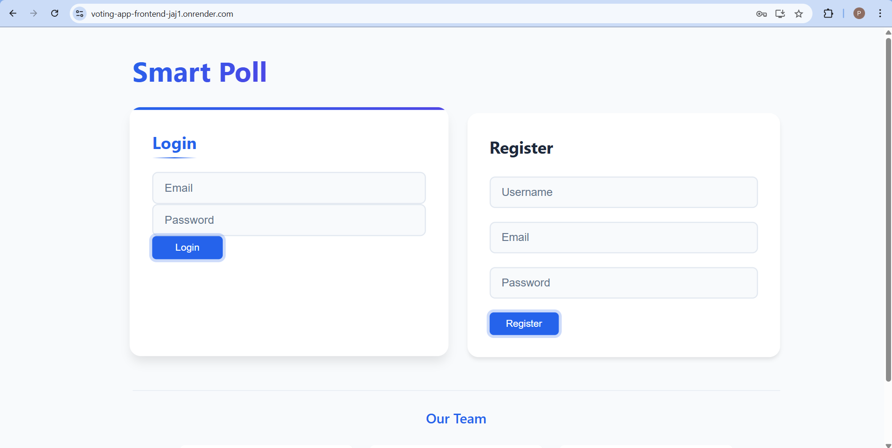

# Smart Poll - Voting Application

A modern, full-stack voting application built with the PERN stack (PostgreSQL, Express.js, React, Node.js). This application allows users to create polls, vote on topics, and view real-time results.



## Features

- 🔐 User Authentication (Register/Login)
- 📊 Create and Manage Voting Topics
- 🗳️ Cast Votes on Topics
- 📈 Real-time Vote Results
- 👥 User Role Management (Admin/User)
- 🔒 Secure Session Management
- 🌐 Responsive Design

## Tech Stack

### Frontend
- React.js
- React Router
- Axios
- CSS3

### Backend
- Node.js
- Express.js
- PostgreSQL
- Express Session

## Prerequisites

- Node.js (v14 or higher)
- npm (v6 or higher)
- PostgreSQL (v12 or higher)

## Installation

1. Clone the repository
```bash
git clone https://github.com/yourusername/smart-poll.git
cd smart-poll
```

2. Install backend dependencies
```bash
cd server
npm install
```

3. Install frontend dependencies
```bash
cd ../client
npm install
```

4. Set up environment variables
Create a `.env` file in the server directory:
```env
PORT=5000
DB_HOST=localhost
DB_USER=your_db_user
DB_PASSWORD=your_db_password
DB_NAME=voting_app
SESSION_SECRET=your_secret_key
```

5. Initialize the database
```bash
cd server
psql -U your_db_user -d voting_app -f init-db.sql
```

## Running the Application

1. Start the backend server
```bash
cd server
npm start
```

2. Start the frontend development server
```bash
cd client
npm start
```

The application will be available at:
- Frontend: http://localhost:3000
- Backend: http://localhost:5000

## Deployment

This application is configured for easy deployment on Render.com. The `render.yaml` files in both client and server directories contain the necessary configuration.

### Backend Deployment
1. Create a new Web Service on Render
2. Connect your GitHub repository
3. Select the server directory
4. Set environment variables
5. Deploy

### Frontend Deployment
1. Create a new Static Site on Render
2. Connect your GitHub repository
3. Select the client directory
4. Set environment variables
5. Deploy

## API Endpoints

### Authentication
- `POST /api/register` - Register a new user
- `POST /api/login` - Login user
- `POST /api/logout` - Logout user

### Topics
- `GET /api/topics` - Get all topics
- `POST /api/topics` - Create a new topic (Admin only)

### Voting
- `POST /api/vote` - Cast a vote
- `GET /api/votes/:topicId` - Get vote results for a topic

## Database Schema

### Users Table
```sql
CREATE TABLE users (
    id SERIAL PRIMARY KEY,
    username VARCHAR(255) NOT NULL,
    email VARCHAR(255) UNIQUE NOT NULL,
    password VARCHAR(255) NOT NULL,
    role VARCHAR(50) DEFAULT 'user',
    created_at TIMESTAMP DEFAULT CURRENT_TIMESTAMP
);
```

### Topics Table
```sql
CREATE TABLE topics (
    id SERIAL PRIMARY KEY,
    name VARCHAR(255) NOT NULL,
    created_by INTEGER REFERENCES users(id),
    created_at TIMESTAMP DEFAULT CURRENT_TIMESTAMP
);
```

### Votes Table
```sql
CREATE TABLE votes (
    id SERIAL PRIMARY KEY,
    user_id INTEGER REFERENCES users(id),
    topic_id INTEGER REFERENCES topics(id),
    vote INTEGER NOT NULL,
    created_at TIMESTAMP DEFAULT CURRENT_TIMESTAMP,
    UNIQUE(user_id, topic_id)
);
```

## Contributing

1. Fork the repository
2. Create your feature branch (`git checkout -b feature/AmazingFeature`)
3. Commit your changes (`git commit -m 'Add some AmazingFeature'`)
4. Push to the branch (`git push origin feature/AmazingFeature`)
5. Open a Pull Request

## License

This project is licensed under the MIT License - see the [LICENSE](LICENSE) file for details.

## Team

- Yashwanth Gundla - Frontend Developer
- Jayasairohit Valasapalli - Backend Developer
- Akhila Gotike - Tester
- Tharun Javaji - Quality Assurance

## Acknowledgments

- Express.js documentation
- React documentation
- PostgreSQL documentation
- Render.com documentation 